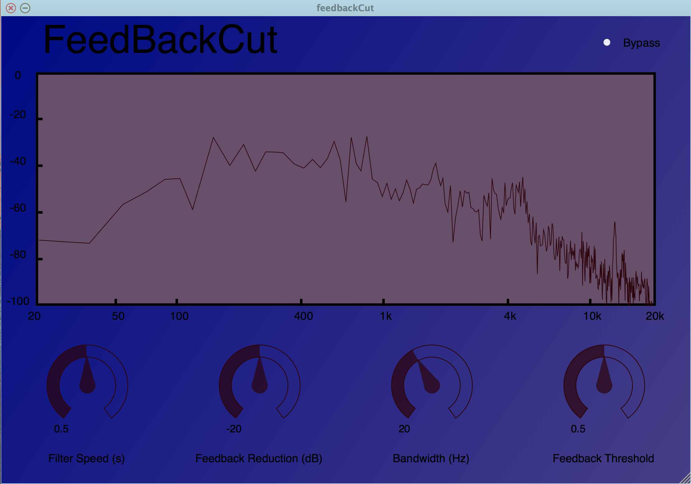

# feedbackCut

# Short Description
An audio plugin which aims to detect acoustic feedback and cancel it with the use of an adaptive filter. The plugin is mean't to be used in a live sound setting, and will cancel feedback in a musical way by only applying the correction when it is needed, not at all times. There are four user controlled parameters to control the plugin, they are: 

-Speed: determines how fast the filter is applied once a feedback is detected. The reduction in dB is applied incrementally over a certain number of buffers which is proportional to the speed.

-Reduction: sets the maximum gain (reduction) in dB of the filter that is applied.

-Bandwidth: sets the bandwidth of a parametric equalizer which is used to reduce the feedback.

-Threshold: Sets a threshold value between feedback and harmonic sound. If the value is lower it will be more sensitive, and more likely to catch all instances of feedback, but also more likely to misclasify a musical sound as feedback. Values around 0.6 seem to be pretty good for classifying between feedback and musical signals. 

Additionally, there is a bypass toggle button, and the name "feedbackCut" will flash red when feedback is detected. An image of the plugin can be seen below.

</img>

<iframe width="560" height="315" src="https://www.youtube.com/embed/yL6cbauyMOg" frameborder="0" allowfullscreen></iframe>

# Implementation and Feedback Detection
The feedback detection is adapted from a method proposed by Rocha and Ferreira [1]. A rolling buffer of size 2048 is used for the frequency analysis and feedback detection. This buffer has the new buffer given by the DAW pushed in at every audio call. Two methods are used to determine if the peak frequency bin is feedback. The first method compares the ratio between the power of the entire spectrum to the energy of the highest peak and it's two neighbors to a user determined threshold. Musical signals will generally have a higher total energy ratio than feedback as it is similar to a pure sinusoid. The second method checks if the same frequency has been a peak for a certain amount of time (set to roughly 40ms depending on the buffer size). Musical signals are more likely to vary in frequency while feedback will stay constant. 

If both of these conditons are met, the plugin will determine that there is an instance of feedback. The frequency peak is then estimated more accurately using quadratic interpolation. A parametric equalizer with negative gain will then be applied at the frequency of the detected feedback. The filter is implemented using a 2nd order parametric equalizer from the standard library of the Faust programming language.

[1] A. Rocha, A. Ferreira, "An Accurate Method of Detection and Cancellation of Multiple Acoustic Feedbacks", Audio Engineering Society, Convention 118, 2005.

# Build Instructions 
Using the Projucer, build the project like a standard JUCE audio plugin. You will have to make sure that the project is properly linked to the JUCE modules and the VST SDK if you wish to build a VST plug-in. More information about JUCE can be found at https://www.juce.com/.

# Documentation
The source code is split between five files. The pluginProcessor files deal with the audio processing, the pluginEditor files deal with the GUI editor, and peakEQ.h is a c++ wrapper around a Faust audio object.
